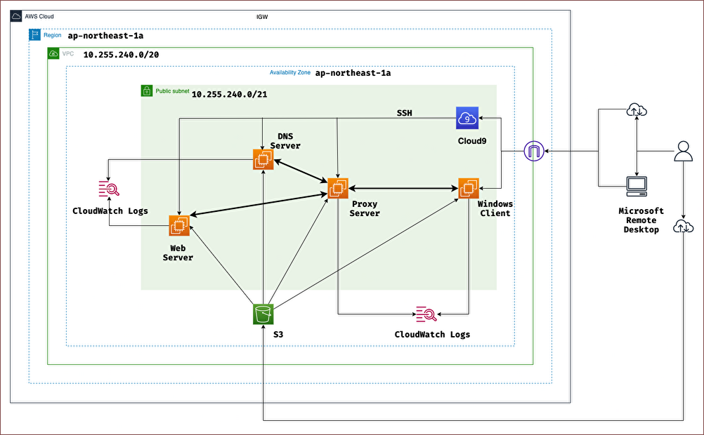

# handson環境構築手順 -AWS Console-

- システム構成図



## 1. VPCの作成

- 名前タグ
  - handson-development-vpc

- IPv4 CIDR
  - 10.255.240.0/20
  - 4096個のリソース分

- IPv6ブロック
  - 無し

- テナンシー
  - デフォルト（共有）

## 2. サブネットの作成

- VPC ID
  - 作成したVPCを選択

- サブネット名
  - handson-development-subnet

- アベイラビリティーゾーン
  - アジアパシティック(東京) / ap-northeast-1a

- IPv4 CIDR
  - 10.255.240.0/21
  - 2048個のリソース分

## 3. インターネットゲートウェイの作成

- インターネットゲートウェイ名
  - handson-development-igw

- VPCにアタッチ
  - 作成したVPCにアタッチ

## 3. ルートテーブルの作成

- ルートテーブル名
  - handson-development-public-rt

- VPC
  - 作成したVPCを選択

- サブネットの関連付け
  - 作成したサブネットを関連付ける

- ルートを追加
  - 0.0.0.0/0
  - 作成したインターネットゲートウェイを追加
（サブネットに作成するEC2がIGWを通じてインターネットへの通信を行えるようにするための処理）

## 4. セキュリティグループの作成

- アウトバウンド
  - 制限無し
- インバウンド
  - 各EC2にプライベートIPを割り当てる前提で設定する
  - Cloud9のEC2はプライベートIPを割り当てられないので作成するサブネットのCIDR範囲で設定する

- 各EC2に割り当てるプライベートIP
  - WebServer
    - `10.255.240.56`
  - DNSServer
    - `10.255.240.74`
  - ProxyServer
    - `10.255.240.38`
  - WindowsClient
    - `10.255.240.131`

### 4-1. WebServer

#### 4-1-1. 基本設定

- セキュリティグループ名
  - handson-development-web-server-sg

- 説明
  - Allow traffic for web server

- VPC
  - 作成したVPCを選択

- タグ
  - key
    - Name
  - Value
    - handson-development-web-server-sg

#### 4-1-2. SSH

- タイプ
  - SSH
- ソース
  - 10.255.240.0/21
- 説明
  - from Cloud9

#### 4-1-3. HTTP

- タイプ
  - HTTP
- ソース
  - 10.255.240.38/32
- 説明
  - from Proxy Server

#### 4-1-4. HTTPS

- タイプ
  - HTTPS
- ソース
  - 10.255.240.38/32
- 説明
  - from Proxy Server

### 4-2. Windows Client

#### 4-2-1. 基本設定

- セキュリティグループ名
  - handson-development-windows-client-sg

- 説明
  - Allow traffic for windows client

- VPC
  - 作成したVPCを選択

- タグ
  - key
    - Name
  - Value
    - handson-development-windows-client-sg

#### 4-2-1. RDP

- タイプ
  - RDP
- ソース
  - 自身のPCのパブリックIPを指定/32
- 説明
  - from My Client

### 4-3. DNS Server

#### 4-3-1. 基本設定

- セキュリティグループ名
  - handson-development-dns-server-sg

- 説明
  - Allow traffic for dns server

- VPC
  - 作成したVPCを選択

- タグ
  - key
    - Name
  - Value
    - handson-development-dns-server-sg

#### 4-3-2. SSH

- タイプ
  - SSH
- ソース
  - 10.255.240.0/21
- 説明
  - from Cloud9

#### 4-3-3. DNS(TCP)

- タイプ
  - DNS(TCP)
- ソース
  - 10.255.240.38/32
- 説明
  - from Proxy Server

#### 4-3-4. DNS(UDP)

- タイプ
  - DNS(UDP)
- ソース
  - 10.255.240.38/32
- 説明
  - from Proxy Server

### 4-4. Proxy Server

#### 4-4-1. 基本設定

- セキュリティグループ名
  - handson-development-proxy-server-sg

- 説明
  - Allow traffic for proxy server

- VPC
  - 作成したVPCを選択

- タグ
  - key
    - Name
  - Value
    - handson-development-proxy-server-sg

#### 4-4-2. SSH

- タイプ
  - SSH
- ソース
  - 10.255.240.0/21
- 説明
  - from Cloud9

#### 4-4-3. HTTP

- タイプ
  - カスタムTCP
- ポート範囲
  - 8080
- ソース
  - 10.255.240.131/32
- 説明
  - from Windows Client

#### 4-4-4. HTTPS

- タイプ
  - HTTPS
- ソース
  - 10.255.240.131/32
- 説明
  - from Windows Client

## 5. キーペア

今回はローカルで作成し、公開鍵をインポートする。

- 名前
  - handson-development-keypair

- タグ
  - key
    - Name
  - Value
    - handson-development-keypair

キーペアファイルの閲覧から公開鍵をインポートする。

## 6. Cloud9の環境の作成

- 名前
  - handson-development-cloud9-ec2

- 説明
  - for Bastion Server

- 新しいEC2インスタンス
  - インスタンスタイプ
    - t2.micro
  - プラットフォーム
    - Amazon Linux 2
  - タイムアウト
    - 30分

- ネットワーク設定
  - 接続
    - セキュアシェル
  - 作成したVPC, subnetを指定

- タグ
  - key
    - EnvironmentName
  - Value
    - handson-development-cloud9-ec2

- 作成されたEC2のタグを変更する
  - key
    - Name
  - Value
    - handson-development-cloud9-ec2

## 7. S3

### 7-1. バケットの作成

- バケット名
  - handson-development-s3

- AWSリージョン
  - アジアパシティック(東京) / ap-northeast-1

- オブジェクト所有者
  - ACL無効

- タグ
  - key
    - Name
  - Value
    - handson-development-s3

### 7-2. 主要ファイルのアップロード

```bash:
s3://handson-development-s3
    ├── keys
    │   ├── handson-development-keypair-for-windows-client.pem
    │   ├── handson-development-keypair.pem
    │   └── handson-development-keypair.pub
    ├── s3_upload
    │   ├── cloud9
    │   │   ├── connection_environment.sh
    │   │   └── connection_information.sh
    │   ├── cloud_watch_logs
    │   │   ├── dns_server_config.json
    │   │   ├── proxy_server_config.json
    │   │   ├── web_server_config.json
    │   │   └── windows_client_config.json
    │   ├── dns_server
    │   │   ├── etc
    │   │   │   ├── 240.255.10.db
    │   │   │   ├── dsset-handson.com.
    │   │   │   ├── handson.com
    │   │   │   ├── handson.com.signed
    │   │   │   ├── named.conf
    │   │   │   ├── named.conf.acl
    │   │   │   ├── named.conf.controls
    │   │   │   ├── named.conf.default-zones
    │   │   │   ├── named.conf.external-zones
    │   │   │   ├── named.conf.internal-zones
    │   │   │   ├── named.conf.logging
    │   │   │   ├── named.conf.options
    │   │   │   ├── rndc.conf
    │   │   │   └── rndc.key
    │   │   ├── keys
    │   │   │   ├── Khandson.com.+008+52340.key
    │   │   │   ├── Khandson.com.+008+52340.private
    │   │   │   ├── Khandson.com.+008+60961.key
    │   │   │   ├── Khandson.com.+008+60961.private
    │   │   │   └── bind.keys
    │   │   ├── named
    │   │   ├── named.service
    │   │   └── netplan
    │   │       └── 99-cloud-init.yaml
    │   ├── proxy_server
    │   │   ├── netplan
    │   │   │   └── 99-cloud-init.yaml
    │   │   └── squid.conf
    │   ├── ssh_secret_key
    │   │   └── handson-development-keypair.pem
    │   ├── web_server
    │   │   ├── 000-default.conf
    │   │   ├── default-ssl.conf
    │   │   ├── html
    │   │   │   └── index.html
    │   │   └── ssl
    │   │       ├── certificate.pem
    │   │       ├── csr.pem
    │   │       └── privatekey.pem
    │   └── windows_client
    │       └── hosts
    └── user_data
        ├── dns_server.sh
        ├── proxy_server.sh
        ├── web_server.sh
        └── windows_client.sh
```

## 8. IAMポリシーの作成

### 8-1. for EC2

1. ポリシーの作成
2. JSONを選択

```json:
{
  "Version": "2012-10-17",
  "Statement": [
    {
      "Sid": "StatementEC2",
      "Effect": "Allow",
      "Action": [
        "s3:GetObject",
        "s3:PutObject",
        "logs:CreateLogGroup",
        "logs:CreateLogStream",
        "logs:PutLogEvents",
        "logs:PutRetentionPolicy"
      ],
      "Resource": [
        "arn:aws:s3:::handson-development-s3/*",
        "arn:aws:logs:*:*:*"
      ]
    }
  ]
}
```

- ポリシー名
  - AllowListPolicyForEC2

- 説明
  - Policy to allow EC2 access to S3, CloudWatch Logs

### 8-2. for Cloud9

1. ポリシーの作成
2. JSONを選択

```json:
{
  "Version": "2012-10-17",
  "Statement": [
    {
      "Sid": "StatementCloud9",
      "Effect": "Allow",
      "Action": [
        "s3:GetObject"
      ],
      "Resource": [
        "arn:aws:s3:::handson-development-s3/*"
      ]
    }
  ]
}
```

- ポリシー名
  - AllowListPolicyForCloud9

- 説明
  - Policy to allow Cloud9 access to S3

## 9. IAMロールの作成

### 9-1. for EC2

1. 信頼されたエンティティを選択

- 信頼されたエンティティタイプ
 - AWSのサービス
- ユースケース
 - EC2


2. 許可を追加

`AllowListPolicyForEC2`を選択

- ロール名
  - IAMRoleForEC2

- 説明
  - IAM Role for EC2

### 9-2. for Cloud9

1. 信頼されたエンティティを選択

- 信頼されたエンティティタイプ
 - AWSのサービス
- ユースケース
 - EC2

2. 許可を追加

`AllowListPolicyForCloud9`を選択

- ロール名
  - IAMRoleForCloud9

- 説明
  - IAM Role for Cloud9

## 10. EC2の作成

### 10-1. WebServer

- 名前
  - handson-development-web-server

- AMI
  - ami-0ed99df77a82560e6

- アーキテクチャ
  - 64ビット（x86）
  - デフォルト

- インスタンスタイプ
  - t2.micro

- キーペア
  - インポートしたキーペアを指定

- ネットワーク設定の編集
  - VPC, subnetを作成したものに変更
  - パブリックIPの自動割り当てを有効化
  - 作成したセキュリティグループを割り当てる（選択のみ）

- 高度なネットワーク設定
  - ネットワークインターフェース
    - 新しいネットワークインターフェースを作成
  - 説明
    - network interface for web server
  - セキュリティグループ
    - 作成したものを設定
  - プライマリIP
    - 10.255.240.56
  - 終了時に削除
    - はい

- 高度な詳細
  - ユーザデータ
    - `project_files/user_data/web_server.sh`
  - IAMインスタンスプロフィール
    - `IAMRoleForEC2`

### 10-2. Windows Client

- 名前
  - handson-development-windows-client

- AMI
  - ami-02e06112a2480834a

- 差分
  - 説明
    - network interface for windows client
  - プライマリIP
    - 10.255.240.131

- 高度な詳細
  - ユーザデータ
    - `project_files/user_data/windows_client.sh`
  - IAMインスタンスプロフィール
    - `IAMRoleForEC2`

### 10-3. DNS Server

- 名前
  - handson-development-dns-server

- AMI
  - ami-0ed99df77a82560e6

- 差分
  - 説明
    - network interface for dns server
  - プライマリIP
    - 10.255.240.74

- 高度な詳細
  - ユーザデータ
    - `project_files/user_data/dns_server.sh`
  - IAMインスタンスプロフィール
    - `IAMRoleForEC2`

### 10-4. Proxy Server

- 名前
  - handson-development-proxy-server

- AMI
  - ami-0ed99df77a82560e6

- 差分
  - 説明
    - network interface for proxy server
  - プライマリIP
    - 10.255.240.38

- 高度な詳細
  - ユーザデータ
    - `project_files/user_data/proxy_server.sh`
  - IAMインスタンスプロフィール
    - `IAMRoleForEC2`

## 11. Cloud9から各EC2にアクセス出来るようにする

Cloud9にIAMロールをアタッチ
`AllowListPolicyForCloud9`

### 11-1. スクリプトの用意

- Cloud9から各EC2に接続するまでのスクリプト
  - `project_files/s3_upload/connection_environment.sh`

- 各EC2に接続するコマンドを確認するためのスクリプト
  - `project_files/s3_upload/connection_information.sh`

### 11-2. Cloud9でスクリプトをダウンロードする

```bash:
sudo aws s3 cp s3://handson-development-s3/cloud9/connection_environment.sh /home/ec2-user/environment/
sudo aws s3 cp s3://handson-development-s3/cloud9/connection_information.sh /home/ec2-user/environment/

sudo chmod 700 /home/ec2-user/environment/*.sh
sudo chown ec2-user:ec2-user /home/ec2-user/environment/*.sh
```

### 11-3. スクリプトの実行

- 各EC2にアクセスできるようにする
`$ /home/ec2-user/environment/./connection_environment.sh`

- 各EC2にアクセスするためのコマンドの確認
`$ /home/ec2-user/environment/./connection_information.sh`

## 12. Windows ClientからWebServerにアクセス

### 12-1. Windows ClientにRDPでログイン

- Microsoft Remote Desktop
  - PC name
    - WindowsClientのパブリックIP
  - User account
    - Username
      - Administrator
    - Password
      - WindowsPasswordの取得から

### 12-2. EdgeからWebServerにアクセス

1. http通信
`http://www.handson.com`


2. https通信
`https://www.handson.com`


